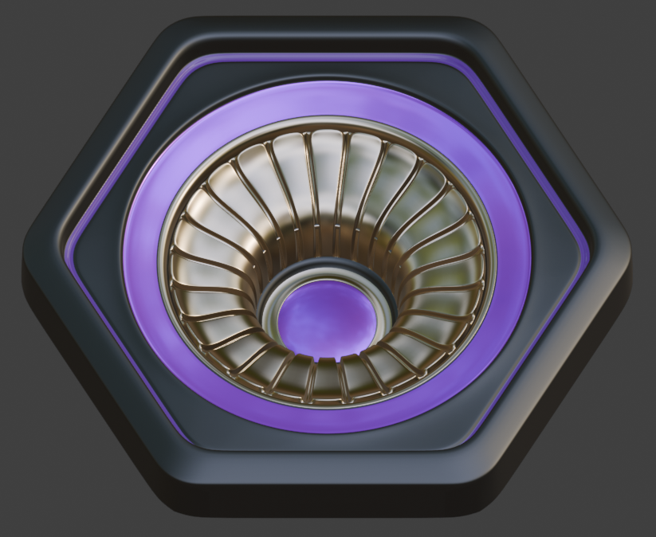
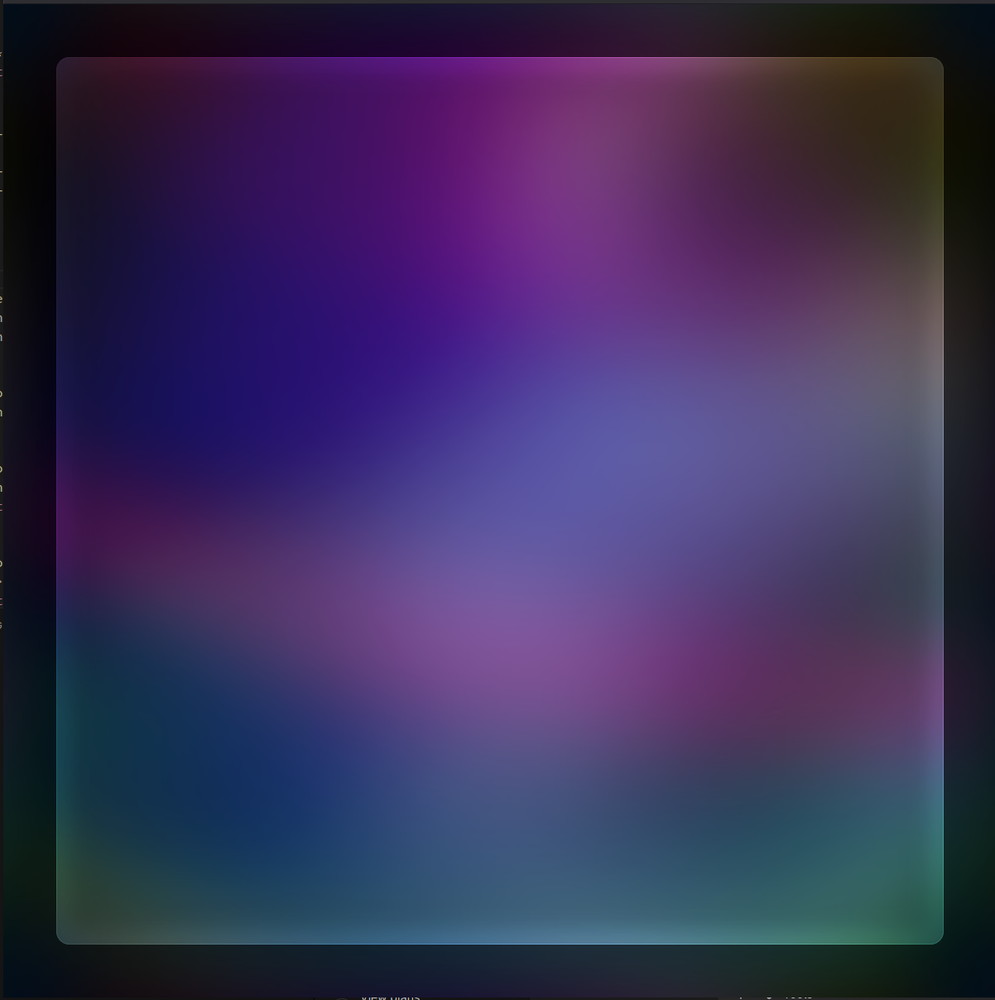

# Orbiter - a different form of navigation
Orbiter redefines navigation by replacing traditional tabbed interfaces with a dynamic stack of code panes, each representing a focused context—like a module, function, or symbol  User holds Shift to rearrange these panes in the scroll/mini-map area, where each region is color-coded for clarity. With this design, Orbiter is a bit more in sync with your mental workspace.  AI is us, so our workspace should be a reflection of us.

# Large workflow maintenance for the user?
It's certainly deliberate management, but less than tabbed user-interfaces. The tabbed interface disrupts flow by shuffling your context around into buttons that Inherently move with constant additions.

Not every file you open goes into workspace (unless it's shift-enter or shift-click).  The primary mechanism
is to bring up the file in the alt pane (on the right side by default).  We suppose it's a bit like Xcode
assistant, however you are your own butler here.  You choose what goes there.  The 'assistant' is Orbiter's code-nav, explained below:

# an AI PC attempt
Orbiter is an open source attempt at an AI-PC application that runs on existing PCs.

We run hyperspace modeling to sync the users eyes and voice with the editor.
The words we are looking at (long with the actual word) is given in to LLM queries.
It is to support both local and remote LLM integration into your particular stack.

We create this stack not only because its easier to deal with, but to also architect a better navigation model: that is dedicating to finding to the code we seek.  This model is called code-nav, and its designed
to be accessible by Dictation.

To use Dictation, hold shift and tell Orbiter where you want to go, and it will scroll to the place you need to be in workspace.

Whisper is the audio modeling preferred, and the navigation model (code-nav) is to be openly trainable.
The design of code-nav is to work with workspace navigation, or single-file you have open in alt view.

With ourselves in sync with focus-built AI's, we may navigate better and thus produce better.

Lets see what the Orbiter agent looks like:



# Work in progress
- Succinct CSS Styling on native C UX
    - [ion](https://github.com/ar-visions/ion) object based composition
        - [x] Allows for React-like UX, events auto-bound with A-type meta-data
            - [x] Improvements to general CSS, with ', transition-time curve-ease-enum in/out'
```
button.record {
    content:            "record";
}

button.record:hovered {
    content:            "- record -";
    fill-color:         #00f, 222ms;
    border-color:       #fff, 4444ms;
    text-shadow-color:  #000f;
}

button.record:pressed {
    fill-color:         #f00, 222ms;
    border-color:       #ff8, 4444ms;
    text-shadow-color:  #000f;
}

element.root / pane / button.record:selected {
    fill-color:         #24a;
    text-color:         #fff;
    border-color:       #fff;
}
```
#
- [ ] Debugger
    - [x] [dbg](https://github.com/ar-visions/dbg) LLM-based debugger
        - [x] Automatic break-point binds to app model
        - [ ] Member exploration with custom data navigation activations 
            - (needed for A-type, and many of our C projects)

example of this api usage:
```
    path location = f(path, "/src/A/debug/test/a-test");
    path src      = f(path, "/src/A/test/a-test.c");
    app->debug    = dbg(
        location,  f(path, "/src/A/debug/test/a-test"),
        target,    app);
        
    # this will use A-type bind API to lookup ALL required/optional methods
    # to bind on your app, and give errors for ones that fail to bind
    # this is automatic API bindings, with errors to guide you.

    set_breakpoint(a->debug, src, 19, 0);
    set_breakpoint(a->debug, src, 20, 0);
    start(a->debug);
```
#
- [x] Composed UX Elements
    - [ ] Main Menu
    - [ ] Directories Nav
    - [ ] Data Views for Member Properties
    - [ ] Callstack Navigation
    - [x] Vulkan background render (Orbiting Earth, with multiple layered NASA data view of our home planet)
        - [x] [trinity](https://github.com/ar-visions/trinity) Our graphics subsystem library for creating and displayed shaded models in scene, in one or more windows

This blends several views together, based on channel-levels in canvases draw-to:


    - [x] Multiple Skia canvases (or canvai) that blend together with blur layers to compose a frosted view
        - [x] Overlay (images, icons, text, anything with explicit color/alpha output)
        - [x] Compose (the amount of frost to allow to come through, and what level of blur (3 to choose from))
            - 0/2: None
            - 1/2: Low Blur  (Reduced Mip Level 1, Slight Blur)
            - 2/2: High Blur (Reduced 2x, and Frosted)
        - [x] Colorize
            - (r/g channels): HSV filter on the composer blend
            - (b): An amount to blend into final output
#
- [ ] Component system to make use of ion UX
    - [x] Button
    - [ ] Toggle
    - [ ] Radio
    - [ ] Slider
#
- [ ] Simplified Editor
    - [ ] Shaded with trinity composition layers
    - [ ] Accelerated Skia-driven text editing with Vulkan Backend
        - [x] Will not have code folding, ever
        - [x] Will not have tool-tips
        - [x] Will not have popups that cover up code (that is for the left side)
        - [x] Will not have code dragging
    - [ ] Code is colorized by a real parser, not regex
        - The goal with this data is to be in sync with the compiler: (direct user of this apply to [silver](https://github.com/ar-visions/silver) language only, in works)
    - [ ] Workspace/File/Directories search is white-space insensitive
        - Finding "a   string" will find "a string"
#
- [ ] The goal of Orbiter is to be less than 4000 lines of code (this repo), and completely transformable.

- [ ] Console for Debug and Launching (top or bottom stationed)
- [ ] Application menu to control layout ordering / visibility
    - Toggle to Hide/Show
    - Drag to Re-Order
    * Drag and drop should only be in very unique places on an interface (never in the code editor)